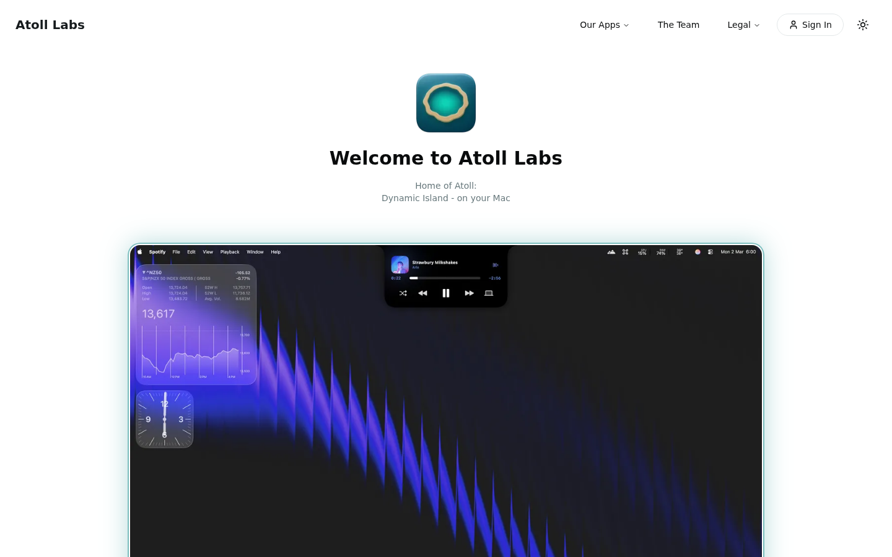

# Atoll - Dynamic Island for macOS

This is Ziad's fork of [Ebullioscopic/Atoll](https://github.com/Ebullioscopic/Atoll).

Atoll turns the MacBook notch into a focused command surface for media, system insight, and quick utilities. It stays out of the way until needed, then expands with responsive, native SwiftUI animations.

## Highlights

- Media controls for Apple Music, Spotify, and more with inline previews.
- Live Activities for media playback, Focus, screen recording, privacy indicators, downloads (beta), and battery/charging.
- Lock screen widgets for media, timers, charging, Bluetooth devices, and weather.
- Lightweight system insight for CPU, GPU, memory, network, and disk usage.
- Productivity tools including timers, clipboard history, color picker, and calendar previews.
- Customization for layouts, animations, hover behavior, and shortcut remapping.

## Requirements

- macOS 14.0 or later (optimised for macOS 15+).
- MacBook with a notch (14/16-inch MBP across Apple silicon generations).
- Xcode 15+ to build from source.
- Permissions as needed: Accessibility, Camera, Calendar, Screen Recording, Music.

## Installation

1. Download the latest DMG from [upstream releases](https://github.com/Ebullioscopic/Atoll/releases/latest).
2. Open the DMG and drag Atoll into Applications.
3. Launch Atoll and grant the requested permissions.

## Quick Start

- Hover near the notch to expand; click to enter controls.
- Use tabs for Media, Stats, Timers, Clipboard, and more.
- Adjust layout, appearance, and shortcuts from Settings.

## License

Atoll is released under the GPL v3 License. Refer to [LICENSE](LICENSE) for the full terms.

---

Built by [Ziad Ahmed](https://github.com/Ziad-NasrEldin) at [MaVoid](https://mavoid.com).

[Website](https://mavoid.com) · [LinkedIn](https://linkedin.com/in/ziad-ahmed-634202332) · [GitHub](https://github.com/Ziad-NasrEldin)
